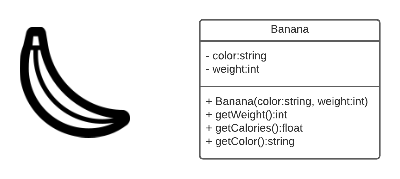
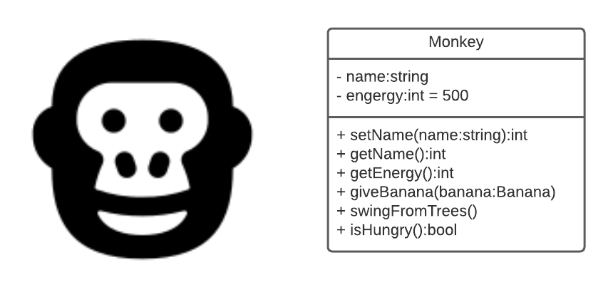

# In Class Encapsulation Exercise 

We'll create two Classes/Objects in class together to illustrate the use of Encapsulation.

Download or clone this project to you computer. 

1. Banana:
    * Properties    
      * color
      * weight
    * Methods
      * getWeight -- Returns the weight
      * getCalories -- Returns the calories
      * getColor -- Returns the color

2. Monkey:
   * Properties:
      * Name
      * energy
   * Methods:
      * setName - gives the monkey a name
      * getName - returns the name of the monkey
      * getEnergy - get the monkeys energy level
      * giveBanana - give the monkey a banana to eat
         * Monkey will only eat yellow bananas
            * Monkey gains energy from the banana’s calories
         * swingFromTrees - uses energy
         * isHungry - checks to see if the monkey is hungry
            * If the monkey’s energy level is low the return true
            * Otherwise return false